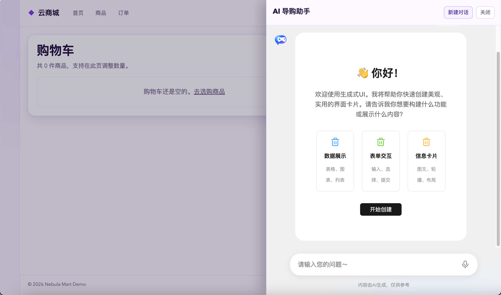
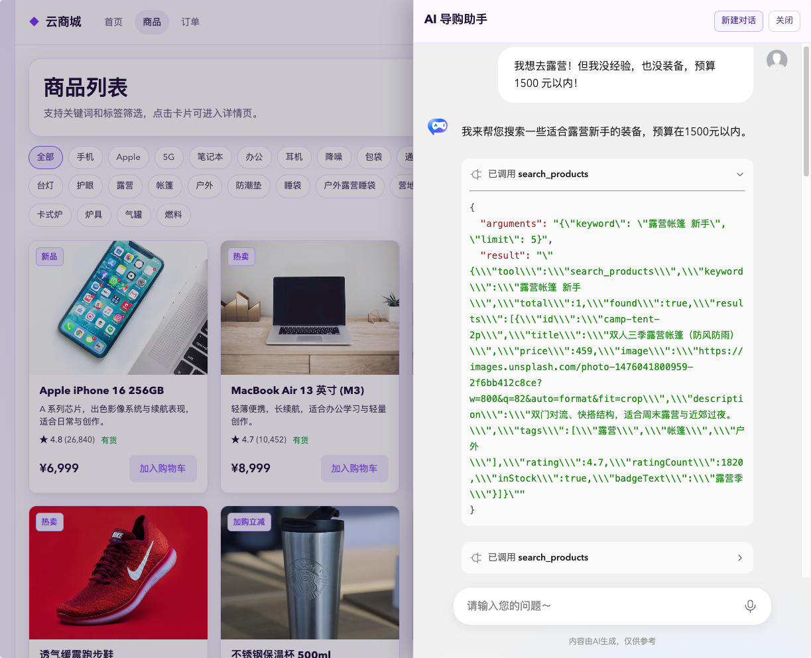
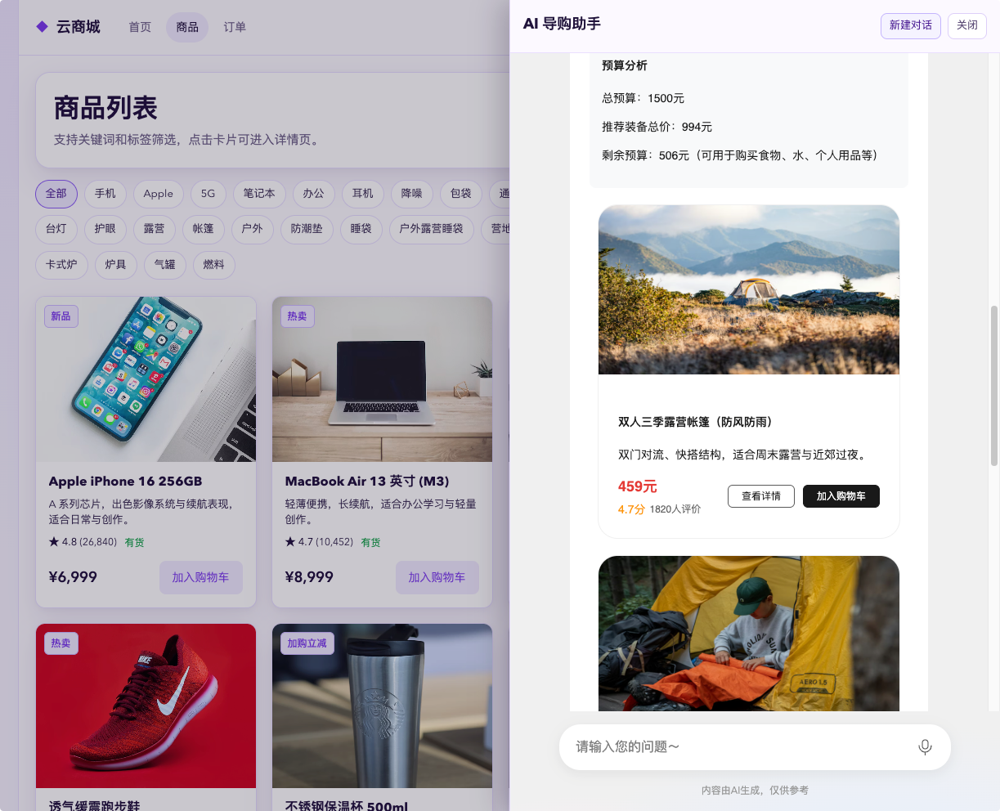
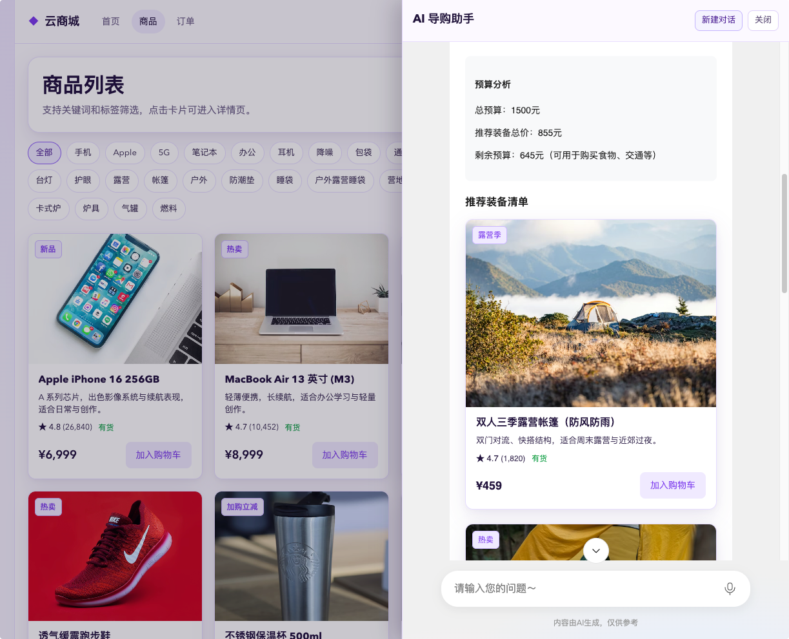
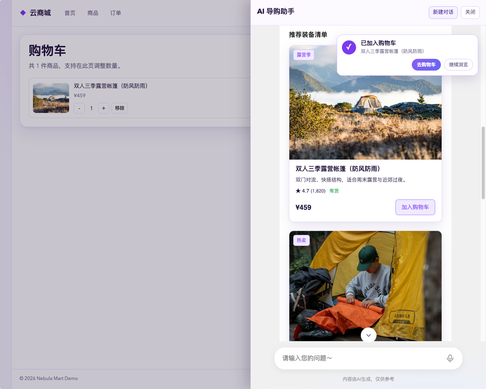

# 电商系统集成生成式 UI 指导文档


---

## 1. 集成目标

在电商前端中加入一个「AI 导购助手」，能力包含：

- 通过 `GenuiChat` 展示对话与生成式 UI 内容
- 通过 MCP 工具实时搜索商品
- 渲染自定义商品卡片组件
- 支持 AI 触发交互动作：加购、跳转商品详情、跳转购物车

---

## 2. 前置准备

### 2.1 环境要求

- Node.js `18+`
- pnpm `10+`

### 2.2 安装项目依赖

在仓库根目录执行：

```bash
pnpm install
```

### 2.3 启动 GenUI 后端服务

1) 进入 `server` 目录，复制环境变量文件：

```bash
cd server
cp .env.example .env
```

2) 编辑 `server/.env`，至少配置：

- `API_KEY`：你的模型服务 Key
- `BASE_URL`：模型服务地址（OpenAI 兼容接口）
- `PORT`：服务端口（默认 `3100`）

3) 回到仓库根目录启动服务：

```bash
pnpm dev:server
```


运行成功后就可以看到控制台输出了`genui-sdk-server is running on http://localhost:3100`

> 大模型对话接口为 `http://localhost:3100/chat/completions`。

至此，后台服务就准备完成了，下面来进行前端的改造。

---

## 3. 前端安装 GenUI 相关依赖

在 `packages/e-commerce` 中需要这些依赖：

- `@opentiny/genui-sdk-vue`
- `@modelcontextprotocol/sdk`
- `zod`
- `openai`

可执行：

```bash
pnpm -F e-commerce add @opentiny/genui-sdk-vue @modelcontextprotocol/sdk openai zod
```

---

## 4. 集成GenuiChat：生成式UI初体验

先做最小可体验版本：只要能看到聊天框、发送消息后，能接受到大模型返回就算成功。

### 4.1 新建 AI 对话助手

创建 `src/components/AIAssistantDrawer.vue`, 代码如下：
```html
<script setup lang="ts">
import { computed, ref, type ComponentPublicInstance } from 'vue'
import { GenuiChat, GenuiConfigProvider } from '@opentiny/genui-sdk-vue'

const props = defineProps<{
  modelValue: boolean
}>()

const emit = defineEmits<{
  (e: 'update:modelValue', value: boolean): void
}>()

type GenuiChatExposed = ComponentPublicInstance & {
  handleNewConversation: () => void
}

const chatRef = ref<GenuiChatExposed | null>(null)
const theme = ref<'dark' | 'lite' | 'light'>('light')
const model = ref('deepseek-v3.2')
const temperature = ref(0)

const chatConfig = {
  addToolCallContext: false,
  showThinkingResult: true,
}

const chatUrl = 'http://localhost:3100/chat/completions'

function closeDrawer() {
  emit('update:modelValue', false)
}

function startNewConversation() {
  chatRef.value?.handleNewConversation()
}

</script>

<template>
  <Teleport to="body">
    <Transition name="drawer-fade">
      <div v-if="modelValue" class="assistant-layer" @click.self="closeDrawer">
        <aside class="assistant-drawer" aria-label="AI 导购助手">
          <header class="assistant-drawer__header">
            <div>
              <h2>AI 导购助手</h2>
            </div>
            <div class="assistant-drawer__actions" role="toolbar" aria-label="助手操作">
              <button type="button" class="assistant-drawer__action" @click="startNewConversation">
                新建对话
              </button>
              <button type="button" class="assistant-drawer__close" @click="closeDrawer">关闭</button>
            </div>
          </header>

          <section class="assistant-drawer__content">
            <div class="assistant-chat">
              <GenuiConfigProvider :theme="theme">
                <GenuiChat
                  ref="chatRef"
                  :url="chatUrl"
                  :model="model"
                  :temperature="temperature"
                  :chat-config="chatConfig"
                />
              </GenuiConfigProvider>
            </div>
          </section>
        </aside>
      </div>
    </Transition>
  </Teleport>
</template>

<style scoped>
.drawer-fade-enter-active,
.drawer-fade-leave-active {
  transition: opacity 0.2s ease;
}

.drawer-fade-enter-from,
.drawer-fade-leave-to {
  opacity: 0;
}

.assistant-layer {
  position: fixed;
  inset: 0;
  z-index: 75;
  background: rgba(17, 8, 38, 0.26);
  display: flex;
  justify-content: flex-end;
}

.assistant-drawer {
  width: min(600px, 95vw);
  height: 100%;
  background: #fcf9ff;
  border-left: 1px solid #e5d9ff;
  box-shadow: -12px 0 34px rgba(20, 8, 41, 0.24);
  display: flex;
  flex-direction: column;
}

.assistant-drawer__header {
  padding: 16px;
  border-bottom: 1px solid #eadfff;
  display: flex;
  justify-content: space-between;
  gap: 12px;
}

.assistant-drawer__header h2 {
  margin: 0;
  color: #20133c;
  font-size: 18px;
}

.assistant-drawer__header p {
  margin: 4px 0 0;
  color: #73668d;
  font-size: 12px;
}

.assistant-drawer__actions {
  display: flex;
  flex-shrink: 0;
  align-items: flex-start;
  gap: 8px;
}

.assistant-drawer__action,
.assistant-drawer__close {
  border: 1px solid #ddcff9;
  background: #fff;
  color: #5e4e79;
  border-radius: 8px;
  height: 32px;
  padding: 0 10px;
  cursor: pointer;
  font-size: 13px;
  white-space: nowrap;
}

.assistant-drawer__action {
  border-color: #c4b5fd;
  color: #4c1d95;
  background: #f5f3ff;
}

.assistant-drawer__action:hover {
  background: #ede9fe;
}

.assistant-drawer__content {
  min-height: 0;
  flex: 1;
}

.assistant-chat {
  height: 100%;
}

.assistant-chat :deep(.tiny-config-provider) {
  height: 100%;
}

@media (max-width: 760px) {
  .assistant-drawer {
    width: 100vw;
  }
}
</style>

```

添加完成后，还需要在`App.vue`中引入并使用。

引入使用`AIAssistantDrawer`
```js
import AIAssistantDrawer from './components/AIAssistantDrawer.vue'
import { ref } from 'vue'

const assistantOpen = ref(false)
```

加入悬浮球，用于控制助手的隐藏显示。
```html
    <button
      class="assistant-fab"
      type="button"
      aria-label="打开 AI 导购助手"
      @click="assistantOpen = true"
    >
      <span class="assistant-fab__dot">AI</span>
      <span class="assistant-fab__text">
        导购助手
        <small v-if="totalCount > 0">{{ totalCount }} 件待结算</small>
      </span>
    </button>

    <AIAssistantDrawer
      v-if="assistantOpen"
      v-model="assistantOpen"
    />
```

给悬浮球配置一下样式
```css
.assistant-fab {
  position: fixed;
  right: 18px;
  bottom: 20px;
  z-index: 72;
  border: 0;
  border-radius: 999px;
  background: linear-gradient(135deg, #8b5cf6 0%, #6366f1 100%);
  color: #fff;
  min-height: 52px;
  padding: 8px 14px 8px 10px;
  display: inline-flex;
  align-items: center;
  gap: 10px;
  box-shadow: 0 10px 24px rgba(77, 46, 141, 0.28);
  cursor: pointer;
}

.assistant-fab__dot {
  width: 34px;
  height: 34px;
  border-radius: 50%;
  display: grid;
  place-items: center;
  font-size: 12px;
  font-weight: 700;
  background: rgba(255, 255, 255, 0.18);
}

.assistant-fab__text {
  display: grid;
  text-align: left;
  gap: 1px;
  font-size: 13px;
  font-weight: 700;
  line-height: 1.2;
}

.assistant-fab__text small {
  font-size: 11px;
  font-weight: 500;
  opacity: 0.88;
}
```


### 4.2 开始体验

运行前端后，点击AI助手的悬浮球，确认：

- 侧边抽屉对话界面能打开/关闭
- 聊天框能正常展示
- 输入消息能体验生成式UI能力

可以尝试在输入中输入“你好呀！”，查看大模型返回。



---

现在生成式UI的能力已经集成到系统中，不过目前的生成式UI和系统还没有半点联系，是两个完全独立的模块。下面我们来将电商系统能力接入到生成式UI当中，使其成为一个智能导购助手。

新建一个文件夹， `src/genui`。

## 5. 集成MCP：商品查询能力赋能

智能助手最重要的一个能力就是商品搜索，因此需要将电商系统中的商品搜索能力接入到智能助手中。

### 5.1 MCP工具开发

新建一个文件 `src/genui/mcp/product-mcp.ts`。我们来开发一个商品搜索的mcp服务。这里我们将业务系统中已有的商品查询能力引入，进过包装后，成功MCP工具。

```js
import { McpServer } from '@modelcontextprotocol/sdk/server/mcp.js'
import { z } from 'zod'
import { searchProducts } from '../../api'
import type { Product } from '../../types'

export const SEARCH_PRODUCTS_TOOL = 'search_products'

export const SearchProductsArgsSchema = z.object({
  keyword: z.string().min(1, 'keyword 不能为空'),
  limit: z.number().int().min(1).max(10).optional(),
})

export const ProductSchema = z.object({
  id: z.string(),
  title: z.string(),
  price: z.number(),
  image: z.string(),
  description: z.string(),
  tags: z.array(z.string()),
  rating: z.number(),
  ratingCount: z.number(),
  inStock: z.boolean(),
  badgeText: z.string(),
})

export const SearchProductsResultSchema = z.object({
  tool: z.literal(SEARCH_PRODUCTS_TOOL),
  keyword: z.string(),
  total: z.number().int().min(0),
  found: z.boolean(),
  results: z.array(ProductSchema),
})

export type SearchProductsArgs = z.infer<typeof SearchProductsArgsSchema>
export type SearchProductsResult = z.infer<typeof SearchProductsResultSchema>

async function searchProductsByBusiness(keyword: string, limit = 4): Promise<Product[]> {
  const results = await searchProducts(keyword)
  return results.slice(0, limit)
}

export function createProductMcpServer() {
  const server = new McpServer(
    { name: 'e-commerce-product-mcp-server', version: '1.0.0' },
    {},
  )

  server.registerTool(
    SEARCH_PRODUCTS_TOOL,
    {
      title: '搜索商品',
      description: '根据关键词在商品库中搜索商品',
      inputSchema: SearchProductsArgsSchema,
    },
    async (rawArgs) => {
      const parsedArgs = SearchProductsArgsSchema.safeParse(rawArgs)
      if (!parsedArgs.success) {
        throw new Error('参数校验失败')
      }

      const { keyword, limit = 4 } = parsedArgs.data
      const results = await searchProductsByBusiness(keyword, limit)

      const payload = SearchProductsResultSchema.parse({
        tool: SEARCH_PRODUCTS_TOOL,
        keyword,
        total: results.length,
        found: results.length > 0,
        results,
      })

      return {
        content: [{ type: 'text', text: JSON.stringify(payload) }],
      }
    },
  )

  return server
}

```

### 5.2 MCP Client开发

有了工具，还需要一个MCP Client去调用工具，下面我来编写MCP Client的代码，这里的MCP Server和MCP Client都运行在同一服务当中，因此我们选择选择使用`InMemoryTransport` 即可。

新建文件`src/genui/mcp/mcp-client.ts`

```js
import OpenAI from 'openai'
import { Client } from '@modelcontextprotocol/sdk/client'
import { InMemoryTransport } from '@modelcontextprotocol/sdk/inMemory.js'
import { createProductMcpServer } from './product-mcp'

let clientPromise: Promise<Client> | null = null

async function createClient() {
  const [clientTransport, serverTransport] = InMemoryTransport.createLinkedPair()
  const server = createProductMcpServer()
  await server.connect(serverTransport)

  const client = new Client({ name: 'e-commerce-product-mcp-client', version: '1.0.0' }, {})
  await client.connect(clientTransport)
  return client
}

export function getMcpClient() {
  if (!clientPromise) clientPromise = createClient()
  return clientPromise
}

export async function getOpenAITools() {
  const client = await getMcpClient()
  const raw = await (client as unknown as { listTools: () => Promise<{ tools?: Array<Record<string, unknown>> }> }).listTools()
  const tools = Array.isArray(raw?.tools) ? raw.tools : []
  return tools
    .filter((tool) => typeof tool?.name === 'string')
    .map(
      (tool) =>
        ({
          type: 'function',
          function: {
            name: tool.name as string,
            description: typeof tool.description === 'string' ? tool.description : '',
            parameters:
              tool.inputSchema && typeof tool.inputSchema === 'object'
                ? (tool.inputSchema as Record<string, unknown>)
                : { type: 'object', properties: {} },
          },
        }) as OpenAI.Chat.Completions.ChatCompletionTool,
    )
}

export async function callMcpToolAsText(name: string, args: Record<string, unknown> = {}) {
  const client = await getMcpClient()
  const result = await client.callTool({ name, arguments: args })
  const content = Array.isArray((result as { content?: unknown }).content)
    ? ((result as { content: Array<{ type?: string; text?: string }> }).content ?? [])
    : []
  const text = content.find((item) => item.type === 'text' && typeof item.text === 'string')?.text
  return text ?? JSON.stringify(result)
}

```

### 5.3 自定义fetch

要想将MCP能力接入到智能助手中，还需要通过自定义fetch。在自定义fetch中，去处理工具的多轮调用和工具参数的流式返回。
新建文件：`src/genui/mcp/custom-fetch.ts`
```js
import OpenAI from 'openai'
import type { CustomFetch } from '@opentiny/genui-sdk-vue'
import { getOpenAITools, callMcpToolAsText } from './mcp-client'

interface OpenAIFetchConfig {
  apiKey: string
  baseURL?: string
  defaultModel?: string
  maxToolSteps?: number
}

type ParsedRequestBody = {
  model?: string
  temperature?: number
  messages?: unknown[]
}

type ToolCallDelta = {
  index?: number
  id?: string
  function?: {
    name?: string
    arguments?: string
  }
}

type ToolCall = {
  id: string
  type: 'function'
  function: {
    name: string
    arguments: string
  }
}

function encodeSseChunk(encoder: TextEncoder, data: unknown) {
  return encoder.encode(`data: ${JSON.stringify(data)}\n\n`)
}

function parseRequestBody(body: string): ParsedRequestBody {
  try {
    return JSON.parse(body) as ParsedRequestBody
  } catch {
    return {}
  }
}

function accumulateToolCalls(target: ToolCall[], deltas: ToolCallDelta[]) {
  for (const delta of deltas) {
    const index = delta.index ?? 0
    const item = (target[index] ??= {
      id: delta.id ?? '',
      type: 'function',
      function: { name: '', arguments: '' },
    })

    if (delta.id) item.id = delta.id
    if (delta.function?.name) item.function.name += delta.function.name
    if (delta.function?.arguments) item.function.arguments += delta.function.arguments
  }
}

async function executeToolCall(toolCall: ToolCall, currentMessages: unknown[]) {
  const createResult = (result: string) => {
    currentMessages.push({ role: 'tool', tool_call_id: toolCall.id, content: result })
    return {
      id: toolCall.id,
      type: 'function',
      function: {
        name: toolCall.function.name,
        arguments: toolCall.function.arguments,
        result,
      },
    }
  }

  try {
    const result = await callMcpToolAsText(toolCall.function.name, JSON.parse(toolCall.function.arguments || '{}'))
    return createResult(JSON.stringify(result))
  } catch (error) {
    return createResult(
      JSON.stringify({
        error: error instanceof Error ? error.message : '工具执行失败',
      }),
    )
  }
}

const systemPrompt = `
你是一个电商导购助手，你的任务是根据用户的需求，推荐商品。禁止使用mock数据，必须使用mcp工具获取商品数据。
你的可展示区域宽度不大，请注意你的布局。商品卡片宽度差不多占满了显示区域，请注意排版，单行只可以放一张商品卡片。
如果缺少的商品，请提示用户，让用户自行通过其他方式购买。
`

export function createMcpOpenAICustomFetch(config: OpenAIFetchConfig): CustomFetch {
  const openai = new OpenAI({
    apiKey: config.apiKey,
    baseURL: config.baseURL,
    dangerouslyAllowBrowser: true,
  })

  const maxToolSteps = config.maxToolSteps ?? 20

  return async (
    _url: string,
    options: {
      method: string
      headers: Record<string, string>
      body: string
      signal?: AbortSignal
    },
  ) => {
    const req: any = parseRequestBody(options.body)

    const encoder = new TextEncoder()

    const stream = new ReadableStream<Uint8Array>({
      async start(controller) {
        try {
          let step = 0
          const currentMessages = [{ role: 'system', content: systemPrompt }, ...req.messages]

          const tools = await getOpenAITools()

          while (step < maxToolSteps) {
            const completion = await openai.chat.completions.create(
              {
                ...req,
                messages: currentMessages as OpenAI.Chat.Completions.ChatCompletionMessageParam[],
                tools,
                tool_choice: 'auto',
                stream: true,
              },
              { signal: options.signal },
            )

            const toolCalls: ToolCall[] = []
            let hasToolCall = false
            let shouldContinue = false

            for await (const chunk of completion) {
              const choice = chunk.choices?.[0]
              if (!choice) continue

              if (choice.delta.tool_calls && choice.delta.tool_calls.length > 0) {
                hasToolCall = true
                accumulateToolCalls(toolCalls, choice.delta.tool_calls as ToolCallDelta[])
              }

              controller.enqueue(encodeSseChunk(encoder, chunk))

              if (choice.finish_reason === 'tool_calls' && toolCalls.length > 0) {
                currentMessages.push({
                  role: 'assistant',
                  content: null,
                  tool_calls: toolCalls,
                })

                const toolResults = await Promise.all(
                  toolCalls.map(async (item, index) => ({ ...(await executeToolCall(item, currentMessages)), index })),
                )

                controller.enqueue(
                  encodeSseChunk(encoder, {
                    id: chunk.id,
                    object: 'chat.completion.chunk',
                    model: chunk.model,
                    created: chunk.created || Math.floor(Date.now() / 1000),
                    choices: [
                      {
                        index: 0,
                        delta: { tool_calls_result: toolResults },
                        finish_reason: 'tool_calls',
                      },
                    ],
                  }),
                )

                shouldContinue = true
                break
              }

              if (choice.finish_reason && choice.finish_reason !== 'tool_calls') {
                shouldContinue = false
                break
              }
            }

            step += 1
            if (!hasToolCall || !shouldContinue) break
          }

          controller.enqueue(encoder.encode('data: [DONE]\n\n'))
          controller.close()
        } catch (error) {
          controller.enqueue(
            encodeSseChunk(encoder, {
              error: {
                message: error instanceof Error ? error.message : 'customFetch 处理失败',
                type: 'custom_fetch_error',
              },
            }),
          )
          controller.error(error)
        }
      },
    })

    return new Response(stream, {
      status: 200,
      headers: {
        'Content-Type': 'text/event-stream',
        'Cache-Control': 'no-cache',
        Connection: 'keep-alive',
      },
    })
  }
}

```


## 6.引入自定义fetch：工具调用

改造一下`AIAssistantDrawer.vue`, 引入并使用自定义fetch

```js
import { createMcpOpenAICustomFetch } from '../genui/mcp/custom-fetch'

// ...省略部分代码
// 在model定义的后面创建自定义fetch
const customFetch = createMcpOpenAICustomFetch({
  apiKey: 'sk-trial',
  baseURL: 'http://localhost:3100',
  defaultModel: model.value,
  maxToolSteps: 20,
})
```
改造一下GenuiChat使用的地方，传入customFetch
```html
<GenuiChat
    ref="chatRef"
    :url="chatUrl"
    :model="model"
    :temperature="temperature"
    :custom-fetch="customFetch"
    :chat-config="chatConfig"
/>
```

这个时候，就可以重新运行项目，然后打开导购助手，输入问题 “我想去露营！但我没经验，也没装备，预算 1500 元以内！”，体验，查看一下助手的回答。

可以看到，这里助手已经可以调用MCP工具去进行商品查询，并实现了多轮的工具调用后生成商品卡片


而且目前生成的商品卡片是由大模型随机生成的排版和样式，体验与原本电商系统中不一致。并且目前点击加入购物车也并未成功。


目前在组件与交互的体验上，仍有部分细节不够完善，整体使用感受尚未达到理想状态。接下来，我们就围绕这两部分进行优化，让组件表现与交互行为更加贴合原生系统体验。

## 7. 自定义组件：复刻原生系统体验，保持一致交互质感

新建文件 `src/genui/chat/custom-components.ts` 复用电商系统中的`ProductCard.vue`商品卡片。填写相关字段和定义好参数。提供给大模型进行理解，ref字段配置组件。在渲染时会渲染指定组件。

```js
import ProductCard from '../../components/ProductCard.vue'

export const customComponents = [
  {
    component: 'ProductCard',
    name: '导购商品卡片',
    description:
      '展示推荐商品信息，单张卡片宽度是600px，请注意排版，另外组件包含onOpen和onAdd事件，请务必给对应的事件绑定对应的交互事件',
    schema: {
      properties: [
        { property: 'id', type: 'string', description: '商品 id' },
        { property: 'title', type: 'string', description: '商品标题', required: true },
        { property: 'price', type: 'number', description: '商品价格', required: true },
        { property: 'image', type: 'string', description: '商品图片 URL' },
        { property: 'description', type: 'string', description: '商品描述' },
        { property: 'tags', type: 'array', description: '标签数组' },
        { property: 'rating', type: 'number', description: '评分，0-5' },
        { property: 'ratingCount', type: 'number', description: '评分人数' },
        { property: 'inStock', type: 'boolean', description: '是否有货' },
        { property: 'badgeText', type: 'string', description: '角标文案' },
        { property: 'onOpen', type: 'function', description: '打开商品详情，必须绑定跳转商品页详情事件' },
        { property: 'onAdd', type: 'function', description: '加入购物车，必须绑定加入购物车事件' },
      ],
    },
    ref: ProductCard,
  },
]

```

可以看到，这里是`ProductCard.vue`是从原有的电商系统引入的，我们没有写一行组件代码。

同样的，在`AIAssistantDrawer.vue`引入并使用自定义组件
```js
import { customComponents } from '../genui/chat/custom-components'
```
```html
<GenuiChat
    ref="chatRef"
    :url="chatUrl"
    :customFetch="customFetch"
    :customComponents="customComponents"
    :model="model"
    :temperature="temperature"
    :chat-config="chatConfig"
/>
```

刷新页面后，重新输入刚刚的问题：“我想去露营！但我没经验，也没装备，预算 1500 元以内！”
可以看到，现在的商品卡片已经和电商系统中的保持一致了。


组件添加完毕后，我们再来添加一下对应的交互
---

## 8. 自定义交互：贴合业务场景，原生体验不割裂
在 `src/genui/chat/custom-actions.ts` 定义交互动作：

- `addToCart`
- `openProduct`
- `openCart`

```js
import { z } from 'zod'
import type { ICustomActionItem } from '@opentiny/genui-sdk-vue'
import type { Product } from '../../types'

const ProductActionSchema = z.object({
  id: z.string(),
  title: z.string(),
  price: z.number(),
  image: z.string().optional(),
  description: z.string().optional(),
  tags: z.array(z.string()).optional(),
  rating: z.number().optional(),
  ratingCount: z.number().optional(),
  inStock: z.boolean().optional(),
  badgeText: z.string().optional(),
})

const OpenProductSchema = z.object({
  productId: z.string(),
})

type CreateActionOptions = {
  addProduct: (product: Product) => void
  openProduct: (id: string) => void
  openCart: () => void
}

export function createCustomActions(options: CreateActionOptions) {
  return [
    {
      name: 'addToCart',
      description: '将商品加入购物车',
      parameters: {
        type: 'object',
        properties: {
          product: {
            type: 'object',
            description: '待加入购物车商品',
            properties: {
              id: { type: 'string', description: '商品 id' },
              title: { type: 'string', description: '商品标题' },
              price: { type: 'number', description: '商品价格' },
              image: { type: 'string', description: '商品图片 URL' },
              description: { type: 'string', description: '商品描述' },
              tags: { type: 'array', description: '标签数组' },
              rating: { type: 'number', description: '评分' },
              ratingCount: { type: 'number', description: '评分人数' },
              inStock: { type: 'boolean', description: '是否有货' },
              badgeText: { type: 'string', description: '角标文案' },
            },
            required: ['id', 'title', 'price'],
          },
        },
        required: ['product'],
      } as const,
      execute: (params: unknown) => {
        const parsed = z
          .object({ product: ProductActionSchema })
          .safeParse(params)
        if (!parsed.success) return
        options.addProduct(parsed.data.product as Product)
      },
    },
    {
      name: 'openProduct',
      description: '跳转到商品详情页',
      parameters: {
        type: 'object',
        properties: {
          productId: { type: 'string', description: '商品 id' },
        },
        required: ['productId'],
      } as const,
      execute: (params: unknown) => {
        const parsed = OpenProductSchema.safeParse(params)
        if (!parsed.success) return
        options.openProduct(parsed.data.productId)
      },
    },
    {
      name: 'openCart',
      description: '打开当前用户购物车页面',
      parameters: {
        type: 'object',
        properties: {},
      } as const,
      execute: () => {
        options.openCart()
      },
    },
  ] as ICustomActionItem[]
}

```

然后在 `AIAssistantDrawer.vue` 中：

- 通过 `createCustomActions(...)` 注入动作
- 把动作绑定到真实业务（购物车和路由）

```js
import type { Product } from '../types'
import { createCustomActions } from '../genui/chat/custom-actions'
import { useCart, useCartNotice } from '../composables'
import { useRouter } from 'vue-router'

const router = useRouter()
const { addToCart } = useCart()
const { showCartNotice } = useCartNotice()

function onAddProduct(product: Product) {
  addToCart(product, 1)
  showCartNotice(product.title)
}

const customActions = computed(() =>
  createCustomActions({
    addProduct: onAddProduct,
    openProduct: (id) => {
      closeDrawer()
      router.push(`/products/${id}`)
    },
    openCart: () => {
      closeDrawer()
      router.push('/cart')
    },
  }),
)

```

```html
<GenuiChat
    ref="chatRef"
    :url="chatUrl"
    :model="model"
    :temperature="temperature"
    :custom-fetch="customFetch"
    :custom-components="customComponents"
    :custom-actions="customActions"
    :chat-config="chatConfig"
/>

```

最后修改一下提示词，加上自定义组件和自定义相互相关的约束
```txt
你是一个电商导购助手，你的任务是根据用户的需求，推荐商品。禁止使用mock数据，必须使用mcp工具获取商品数据。推荐完商品后，最后加上加入购物按钮，并绑定方法，点击跳转到购物。
你的可展示区域宽度不大，请注意你的布局。商品卡片宽度差不多占满了显示区域，请注意排版，单行只可以放一张商品卡片。
商品卡片需要绑定加入购物车事件和打开商品详情事件，请务必给对应的事件绑定对应的交互事件, 禁止自定义方法，必须使用this.callAction中提到的方法， 例如：this.callAction('addToCart', { product: product })
如果缺少的商品，请提示用户，让用户自行通过其他方式购买。
```

集成了自定义组件和自定义交互后，我们再来输入问题 “我想去露营！但我没经验，也没装备，预算 1500 元以内！”，体验，查看一下助手的回答。

卡片生成完毕后，我们点击加入购物车，可以看到，成功地弹出了提示。并且购物车中也添加了对应的商品。


---

至此，一个完整的电商导购助手就完成了~